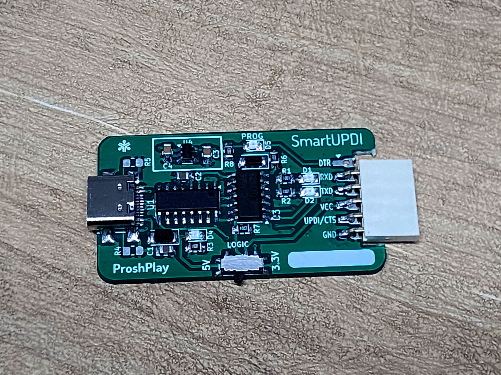
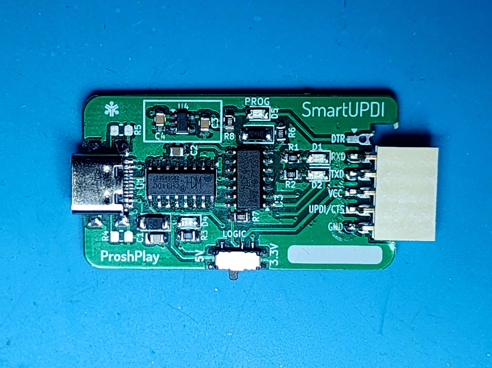

# SmartUPDI

SmartUPDI is an open hardware UPDI programmer and USART adapter for modern AVR microcontrollers. It can switch between programming mode and serial communication with the target device, making it useful for both firmware development and serial debugging.

## Project Report

This repository contains the design files and manufacturing outputs for SmartUPDI. It includes a modified revision of the original Version 1 design. Version 1 was assembled and tested as a working prototype, and the modified revision addresses the known Version 1 issues.

### Features

- UPDI programming for supported AVR microcontrollers
- Switchable connection to the target device's USART interface
- One tool for programming and serial communication during development
- Four to five alternative output connector options for different target hardware setups
- KiCad schematic and PCB source files included
- Gerber manufacturing files included

### Modified Revision

The modified version in this repository improves on the original Version 1 hardware. The previously reported LED issues and macOS automatic switching issue have been resolved in this revision.

The board also provides four to five different output connector options. Users can select the connector arrangement that best suits their target hardware and solder the required connector option during assembly.

### Compatibility And Testing

SmartUPDI has been tested with:

- Linux
- Windows
- Arduino projects using the latest MegaTinyCore
- ATtiny AVR 1-series devices
- AVR128DB-series devices, including AVR128DB-family targets

The original Version 1 prototype worked correctly on Linux and Windows, but had LED issues and problems with automatic switching on macOS. These issues have been addressed in the modified revision contained in this repository.

### Original Version 1.0

## Repository Contents

- `Design Files/` - KiCad project, schematic, PCB layout, and project settings
- `Gerber Files/` - fabrication outputs for manufacturing the PCB
- `Media/` - project and assembled-board photographs

## Building Your Own

Anyone may manufacture SmartUPDI for personal use, education, experimentation, or integration into their own projects. Review the schematic, PCB layout, and Gerber files before fabrication, and verify the board against your own target hardware and power requirements.

## Usage And Distribution Policy

You may build, modify, and use SmartUPDI as needed. Reselling the SmartUPDI project, assembled boards, or kits based on this design is prohibited without the author's permission.

This project is provided as-is. Hardware assembly and use are performed at your own risk. Always confirm voltage levels, wiring, and target-device connections before programming.

## License

See [LICENSE](LICENSE) for the license currently included with this repository. The author's intended project policy is that anyone may build and use SmartUPDI, but resale is prohibited. Because the included CC0 text permits commercial redistribution, the license file should be replaced with a license that explicitly prohibits resale if that restriction must be enforceable.